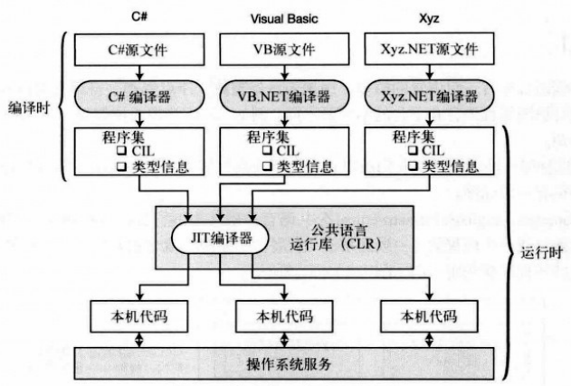

# 第一章 C#和.NET框架
- [第一章 C#和.NET框架](#第一章-c和net框架)
  - [1.1 .NET框架的组成](#11-net框架的组成)
  - [1.2 编译和运行](#12-编译和运行)
    - [1.2.1 编译过程(编译时)](#121-编译过程编译时)
    - [1.2.2 运行过程(运行时)](#122-运行过程运行时)
  - [1.3 CLR](#13-clr)
## 1.1 .NET框架的组成
CRL、编程工具、BCL
1. 执行环境 - **CLR(Common Language RunTime，公共语言运行库)**
   * 功能
      * 内存管理和垃圾收集
      * 代码安全验证
      * 代码执行、线程管理、异常处理
   
2. 编程工具
   * Visual Studio集成开发环境
   * .NET兼容的编译器
   * 调试器
   * Web开发服务器端技术，比如``ASP.NET``。

3. 类库 - **BCL(Base Class Library，基类库)**
   * 通用基类库
   * 集合类
   * 线程和同步类
   * XML 类

## 1.2 编译和运行
### 1.2.1 编译过程(编译时)
**.NET编译器**接受**源代码**文件，并生成**程序集**的输出文件。

1. **源代码文件**----开发人员使用C#等语言写好的代码
2. **程序集**
   
   * 程序集要么是可执行文件（exe），要么是DLL
  
   * 程序集由三部分组成
     * 公共中间语言**CIL（Common Intermediate Language）**，即代码 
     * 类型信息
     * 安全信息

### 1.2.2 运行过程(运行时)
程序运行时，**CIL**直到被调用才会编译成**本机代码**，以供操作系统运行使用。
1. **CLR**调用**JIT（Just-in-Time）编译器**，将需要执行的**CIL**编译成**本机代码**
2. **CIL**一旦被编译成**本机代码**，则由**CLR**在它运行时进行管理

## 1.3 CLR
.NET框架的核心组件、操作系统的顶层、负责管理程序的执行。

1. 托管代码
为.NET框架编写的代码
1. 非托管代码
不在CLR控制下运行的代码