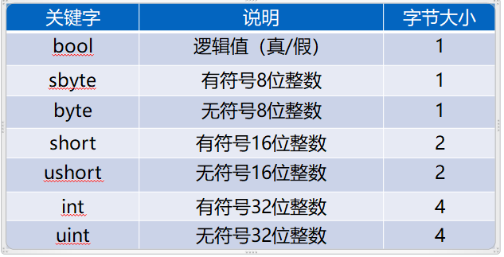
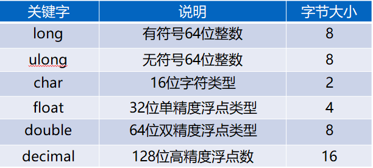

# 第二章 基本数据类型
- [第二章 基本数据类型](#第二章-基本数据类型)
  - [2.1 值类型-基本数据类型](#21-值类型-基本数据类型)
    - [2.1.1 基本数据类型的作用](#211-基本数据类型的作用)
    - [2.1.2 基本数据类型有哪些？](#212-基本数据类型有哪些)
    - [2.1.3 内存](#213-内存)
  - [2.2 变量/常量/运算符](#22-变量常量运算符)
    - [2.2.1 变量](#221-变量)
    - [2.2.2 常量](#222-常量)
    - [2.2.3 运算符](#223-运算符)
  - [2.3 输入、输出函数](#23-输入输出函数)
    - [2.3.1 输出函数](#231-输出函数)
    - [2.3.2 输入函数](#232-输入函数)
  - [2.4 类型转换](#24-类型转换)
    - [2.4.1 隐式转换](#241-隐式转换)
    - [2.4.2 显示转换](#242-显示转换)

## 2.1 值类型-基本数据类型
C#中的**数据类型**分为两种：
* 值类型（基本数据类型）
* 引用类型（复杂数据类型）
### 2.1.1 基本数据类型的作用
作用：**规定容器的大小**，约束内存中存放什么类型的数据。
### 2.1.2 基本数据类型有哪些？


### 2.1.3 内存
内存分为**栈内存**和**堆内存**，而**值类型的数据存放在堆内存中**。

## 2.2 变量/常量/运算符
### 2.2.1 变量
* 运行期间可以改变值的数据空间
* 本质：变量是一个存储空间，被改变的是变量的值。
* 定义：
  * 类型修饰符 变量名 = 初始值;
  * 例如 ``int age = 24;``
* 命名规则：
    1. **只能由字母、数字、下划线或@组成，并且不能以数字开头，@只能用在开头**
    2. **不能与关键字同名**
    3. **不可重复（区分大小写）**
    4. 使用驼峰命名法
    5. 符合命名规范
### 2.2.2 常量
* 运行期间**不能**改变值的数据空间
* 定义：
  * const 类型修饰符 变量名 = 初始值;
  * 例如 ``const int age = 24;``
### 2.2.3 运算符
* 赋值运算符 "="
  * 用于给变量赋值， 将右边的值赋给左边的变量。
* 算术运算符
  * 用于参与数值之间的计算，像：+、-、*、/、%、++、--。
* 复合运算符
  * 是对算术运算符的缩写形式，使得对变量的改变更为简洁。
  * 例子：``a += b;``等价于  ``a = a + b;``
  
## 2.3 输入、输出函数
### 2.3.1 输出函数
```cs
//打印Hello World!
System.Console.WriteLine(“Hello World!”);
```
此方法是 Console 类的输出方法之一。    如果程序开始处包含 “using ”指令，则无需完全限定 System 类和方法即可直接使用它们。 
* 也可以输出多个参数
  * 方法1：使用" + "符号
  ```cs
  //打印num1和num2
  Console.WriteLine (num1 + " "+ num2);
  ```
  * 方法2：使用占位符{0}、{1}、等等
  ```cs
  //打印num1和num2
  Console.WriteLine ("{0},{1}", num3, num4);
  ```
### 2.3.2 输入函数
1. ``Console.Read ();``
    读取一个字符，随便按下一个字符后终止输入操作.
2. ``Console.ReadLine ();``
    读取一行字符，按回车结束输入操作

## 2.4 类型转换
### 2.4.1 隐式转换
* 由**容量小**的类型向**容量大**的类型转换，是一种安全的转换
* 系统会自动转换
```cs
int money = 23;
double money2 = money;
```
### 2.4.2 显示转换
* 显式转换需要强制转换运算符。由**大变小**需要用强制转换，这样需要付出缺失精度的代价。
* 方法:
  1. 使用（类型名）变量名
    ```cs
    int a = 3;
    byte b = (int)a;
    ```
  2. 使用Parse，将字符串转化为其他数据类型
    ```cs
    string a = "33";
    int b  = int.Parse(a);
    ```
  3. 使用Convert进行类型转换
    ```cs
    string a = "33";
    int b  = Convert.ToInt32(a);
    ```