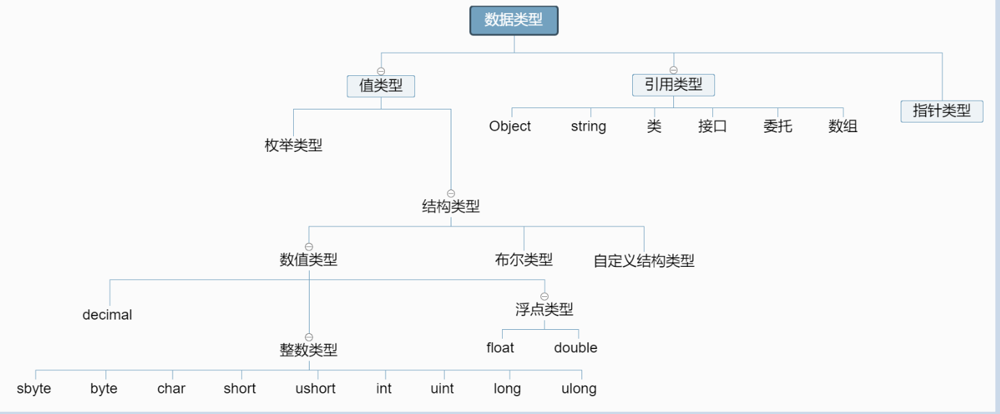

# 第五章 类和面向对象

- [第五章 类和面向对象](#第五章-类和面向对象)
  - [5.1 编程思想](#51-编程思想)
    - [5.1.1 面向过程](#511-面向过程)
    - [5.1.2 面向对象](#512-面向对象)
  - [5.2 类](#52-类)
    - [5.2.1 类的概念](#521-类的概念)
    - [5.2.2 类的作用](#522-类的作用)
    - [5.2.3 类的组成](#523-类的组成)
    - [5.2.4 类的定义](#524-类的定义)
  - [5.3 对象](#53-对象)
    - [5.3.1 对象的概念](#531-对象的概念)
    - [5.3.2 对象的作用](#532-对象的作用)
    - [5.3.3 创建对象（实例化类）](#533-创建对象实例化类)
  - [5.4 类成员](#54-类成员)
    - [5.4.1 字段](#541-字段)
    - [5.4.2 方法](#542-方法)
    - [5.4.3 属性](#543-属性)
  - [5.4 引用数据类型](#54-引用数据类型)
    - [5.4.1 数据类型](#541-数据类型)
    - [5.4.2 值类型](#542-值类型)
    - [5.4.3 引用类型](#543-引用类型)
  - [5.5 方法参数](#55-方法参数)
    - [5.5.1 形参和实参](#551-形参和实参)
    - [5.5.2 引用参数](#552-引用参数)
    - [5.5.3 输出参数](#553-输出参数)
    - [5.5.4 数组参数](#554-数组参数)

## 5.1 编程思想
### 5.1.1 面向过程
面向过程是以**事件**为中心，强调的是完成某一件事情需要的**步骤以及步骤的先后顺序**。侧重点在于实现功能的步骤。代表有**C语言**。
### 5.1.2 面向对象
面向对象以**对象**为中心，强调完成一件事情需要**哪些对象相互协作完成**，参与该事情的**对象需要具备哪些功能**。侧重点在于类的设计（包含了哪些特征与行为）。代表有**C#，Java**。
* 优点：
  * 具有良好的**可扩展性**和**重用性**
  * 面向对象可以**降低我们代码的耦合度**，**提高代码的可移植性**
  * 面向对象更更加接近于日常⽣生活和自然的思考⽅方式，可以提高我们代码软件开发的效率与质量。
  
## 5.2 类
### 5.2.1 类的概念
* 类是描述一类具有相同特征的事物的抽象
* 每个类都包含了**数据说明**和**一组操作数据**或**传递消息的函数**
### 5.2.2 类的作用
* 描述了某类事物具有什么特征以及能够做什么事情
* 类是面向对象程序设计**实现信息封装**的基础
* **“类”是一种构造**，通过使用该构造，可以将其他类型的**变量，⽅法和事件**组合在一起，从而创建自己的**自定义类型**
### 5.2.3 类的组成
* 字段
* 属性
* 方法
### 5.2.4 类的定义
* 使用class关键字
  * class 类名 {类成员}
  * 例如
    * ``class Student{}``

## 5.3 对象
### 5.3.1 对象的概念
对象是类的具体实例
### 5.3.2 对象的作用
使用对象使得我们只需要声明一次变量和过程，就可以在任何需要的时候重用它们
### 5.3.3 创建对象（实例化类）
* 使用new关键字：
  * 类名 对象名= new 类名();
  * 例如
    * ``Student stu = new Student();``

## 5.4 类成员
### 5.4.1 字段
* 字段描述类的特征
* 操作：
  * 定义
  ```CS
  class Hero{
      public string name; //英雄的名字
      public int HP; //英雄的血量
      public string type; //英雄的类别
  }
  ```
  * 赋值
  ```CS
    Hero hero = new Hero ();
    hero.name = "项羽";
    hero.HP = 1000;
    hero.type = "坦克/团控";
  ```
  * 取值
  ```cs
  Console.Write(“英雄名字叫做{0},血量为{1},类型为{2}”,hero.name,hero.HP,hero.type);
  ```
### 5.4.2 方法
* 方法描述了了类具有的行为
* 根据是否有**返回值**和**输入参数**分为四种：
  * **无参数无返回值**
    * 格式：修饰符 void 方法名(){ 方法体 }
    * 使用：对象.方法名()
    * 举例：
    ```cs
    //定义方法
    public void Introduce(){
        Console.WriteLine(“我的名字叫{0},血量有{1},属于{2}类型的英雄”,name,HP,type);
    }
    hero.Introduce();       //调用方法
    ```
  * **无参数有返回值**
    * 格式：修饰符 返回值类型 方法名(){ 方法体 }
    * 使用：变量 = 对象.方法名()
    * ⚠：需要定义变量来接收方法的返回值。
    * 典例：**get方法**
  * **有参数无返回值**
    * 格式：修饰符 void 方法名(参数列列表){ 方法体 }
    * 使用：对象.方法名(参数列列表){ 方法体 }
    * 典例：**set方法**
  * **有参数有返回值**
* 字段与方法默认修饰符都是**private**，并且都可以使用**public**，**protected**，**internal**，**protected internal**来修饰

### 5.4.3 属性
1. 引入
   * 为类中字段手写**Get方法和Set方法**是很麻烦，所以程序帮我们自动的封装出这个两个方法。
2. 封装的方法
   ```cs
   private string brand;
   public string GetBrand()
   {
      return brand;
   }
   public void SetBrand(string value)
   {
      brand = value;
   }
   ```
3. 属性的介绍
属性是这样的成员：它提供灵活的机制来读取、编写或计算某个私有字段的值。 
可以像使用公共数据成员一样使用属性，但实际上它们是称作“访问器”的特殊方法。 
这使得可以轻松访问数据，此外还有助于提高方法的安全性和灵活性。
**属性本质上也是Get和Set方法**，只是在形式上不同。
4. 属性的基本写法
```cs
private int a;
public int A
{
  get{return a;}
  set{a = value;}
}
```
5. 注意点：
   * 不具有set访问器的属性被视为只读属性
   * 不具有get访问器的属性被视为只写属性
6. 简写
   ```cs
   public string Brand { get; set; }
   ```
## 5.4 引用数据类型
### 5.4.1 数据类型
 
 * 注意：string 属于特殊的引用数据类型
### 5.4.2 值类型
**在栈中分配空间**，由系统自动分配。
* 简介：在做赋值操作的时候，值类型和引用类型有很大的区别。值类型变量互相赋值之后，两变量做的任何操作都互不影响，因为他们在不同的空间操作，值类型变量赋值又称为拷贝赋值；
### 5.4.3 引用类型
**在堆中分配空间**，由由程序员用“new”来分配空间。
* 简介：在做赋值操作的时候，值类型和引用类型有很大的区别。值类型变量互相赋值之后，两变量做的任何操作都互不影响，因为他们在不同的空间操作，值类型变量赋值又称为拷贝赋值；

## 5.5 方法参数
### 5.5.1 形参和实参
* 形参：
  * 全称为“形式参数”是在定义函数名和函数体的时候使用的参数，目的是用来接收调用该函数时传递的参数。
* 实参：
  * 可以是常量、变量、表达式、函数等， 无论实参是何种类型的量，在进行函数调用时，它们都必须具有确定的值， 以便把这些值传送给形参。 因此应预先用赋值，输入等办法使实参获得确定值。
### 5.5.2 引用参数
* 值类型参数想要达到引用类型参数的效果，需要用到引用参数。
* 引用参数以ref修饰符声明。
* ref修饰的变量在传递参数前一定要有初始值。
```cs
public void Swap(ref int x,ref int y)
{
     int temp = x;
     x = y;
     y = temp;
}
myMath.Swap(ref score_1,  ref score_2);
```
### 5.5.3 输出参数
* 如果想要一个方法返回多个值,可以用输出参数来处理.输出参数由out关键字标识,既它与普通形参相比只多了个out修饰。
* 在方法中out修饰的参数必须先初始值，才能使用。
* 注意：out修饰的变量在传递前，可以没有初始值
```cs
public void Cal(int a, int b, out int x, out int y)
{
      x = a - b;
      y = a + b;
}

int numOne = 26;
int numTwo = 9;
int resultOne;
int resultTwo;
mymt.Cal(numOne, numTwo, out resultOne, out resultTwo);
Console.WriteLine("resultOne = " + resultOne);
Console.WriteLine("resultTwo = " + resultTwo);
```
### 5.5.4 数组参数
* 如果形参表中包含了数组型参数，那么它必须在参数表中位于最后，而且必须是一维数组类型。另外，数组型参数不可能将params修饰符与ref和out修饰符组合起来使用。
```cs
public void Sum(params int[] a)
{
     int result = 0;
     foreach (int x in a)
     {
          result += x;
     }
		Console.WriteLine("结果为: " + result);
}
mymt.Sum(1, 2, 3, 4, 5);
```
* 注意：
    1. 参数的长度可变。长度可以为0。
    2. 只能使用一次,而且要放到最后。
    3. 后跟数组类型，不能跟ref、out一起搭配使用。