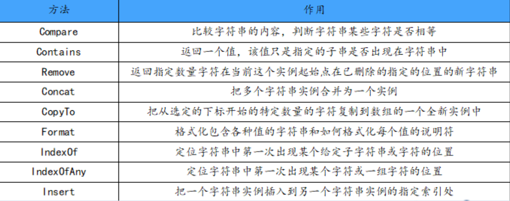
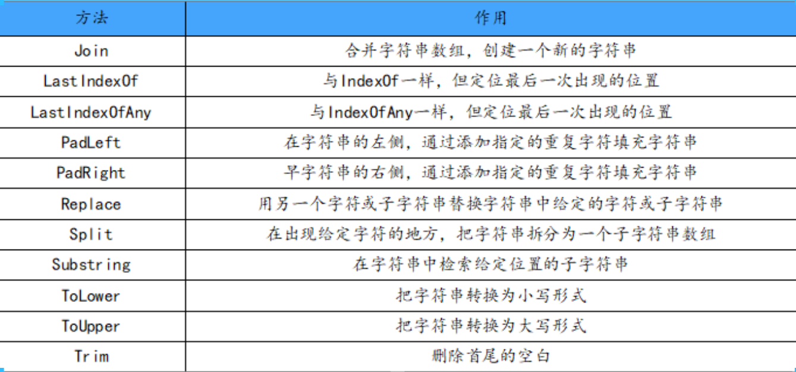
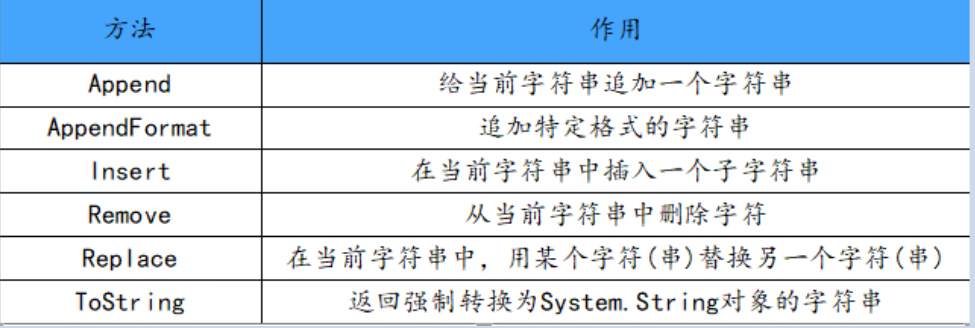

# 第六章 方法的重载和递归
- [第六章 方法的重载和递归](#第六章-方法的重载和递归)
  - [6.1 string类型](#61-string类型)
    - [6.1.1 字符串的方法](#611-字符串的方法)
    - [6.1.2 本质](#612-本质)
  - [6.2 StringBuilder类型](#62-stringbuilder类型)
    - [6.2.1 引出](#621-引出)
    - [6.2.2 两个属性](#622-两个属性)
    - [6.2.3 初始化方法](#623-初始化方法)
    - [6.2.4 重要的方法](#624-重要的方法)
  - [6.3 重载](#63-重载)
    - [6.3.1 什么是重载？](#631-什么是重载)
    - [6.3.2 方法重载的条件](#632-方法重载的条件)
  - [6.4 递归](#64-递归)
    - [6.4.1 递归的概念](#641-递归的概念)
    - [6.4.2 递归的条件](#642-递归的条件)
    - [6.4.3 递归的用处](#643-递归的用处)
    - [6.4.4 递归的缺点](#644-递归的缺点)
    - [练习1](#练习1)
    - [练习2](#练习2)

## 6.1 string类型
在介绍字符串类之前，我们先快速介绍下String类中一些可用的方法。System.String是一个专门存放字符串的类，允许字符串进行许多操作。由于这种数据类型非常重要，C#提供了它自己的关键字和相关的语法，以便于使用这个类来轻松地处理字符串。
* 使用运算符重载可以连接字符串。
    ```cs
    string message1 = "Hello";
    message1 += ", World";
    string message2 = message1 + "!";
    ```
* C#还允许使用类似于索引器的语法来提取指定的字符。
    ```cs
    string message = "Hello";
    char char4 = message[4];
    ```
### 6.1.1 字符串的方法


### 6.1.2 本质
表面上修改字符串内容的方法和运算符实际上创建一个新的字符串。

## 6.2 StringBuilder类型
### 6.2.1 引出
在使用String类构造一个字符串时，要给它分配足够的内存来保存字符串，然而，StringBuilder类通常分配的内存会比它需要的多。我们可以指定StringBuilder要分配多少内存
### 6.2.2 两个属性
* Length：指定字符串的实际长度
* Capacity：指定字符串在分配的内存中的最大长度
### 6.2.3 初始化方法
* 只提供一个字符串
    ```cs
    StringBuilder strB_1 = new StringBuilder("Hello World!");
    ```
* 用给定的容量来创建一个空的
    ```cs
    StringBuilder strB_1 = new StringBuilder(20);
    ```
* 可以限定StringBuilder的最大容量
    ```cs
    StringBuilder strB_1 = new StringBuilder(20, 100);
    ```
### 6.2.4 重要的方法

举例：
```cs
StringBuilder greetingBuilder = new StringBuilder ("Hello, World! ", 100);
greetingBuilder.AppendFormat("Hello, LanOuKeJi!");
```

## 6.3 重载
### 6.3.1 什么是重载？
方法重载是指在同一个类中**方法同名**，**参数不同**，调用时根据**实参的形式**，选择与他匹配的方法执行操作的一种技术。
### 6.3.2 方法重载的条件
1. 参数的类型不同
2. 参数的个数不同
3. 参数的个数相同时他们的先后顺序不同
4. **返回值类型不同，参数相同的充满方法不能构成重载**

## 6.4 递归
### 6.4.1 递归的概念
* 函数体内调用本函数自身，直到符合某一条件不再继续调用
* 注：简单说就是让函数先执行到满足条件的那一步，然后带着数据开始调用函数本身
### 6.4.2 递归的条件
* 有反复执行的过程（**调用自身**）
* 有跳出反复执行过程的条件（**函数出口**）
### 6.4.3 递归的用处
* **斐波那契数列**
    斐波那契数列为：0、1、1、2、3、……，即： 
    fib(0)=0; 
    fib(1)=1; 
    fib(n)=fib(n-1)+fib(n-2) （当n>1时）。 

    可以写成递归函数：
    ```cs
    int fib(int n) 
    { 
        if (n==0) return 0; 
        if (n==1) return 1; 
        if (n>1) return fib(n-1)+fib(n-2); 
    } 
    ```
* **问题解法按递归实现。（回溯）**
* **数据的结构形式是按递归定义的。（二叉树的遍历，图的搜索）**
### 6.4.4 递归的缺点
递归解题相对常用的算法如普通循环等，运行效率较低。因此，应该尽量避免使用递归，除非没有更好的算法或者某种特定情况，递归更为适合的时候。在递归调用的过程当中系统为每一层的返回点、局部量等开辟了栈来存储，因此递归次数过多容易造成栈溢出。

### 练习1
楼梯有N（小于50的整数）阶，上楼可以一步上一价，也可以一次上二阶。编一个程序，计算共有多少种不同的走法。(递归实现)
```cs
static void Main(string[] args)
{
    /*
     楼梯有N（小于50的整数）阶，上楼可以一步上一价，也可以一次上二阶。编一个程序，计算共有多少种不同的走法。(递归实现)
     */
    int n = 6;
    Console.WriteLine("一共有" + GetUpStair(n) + "种走法");
}

static int GetUpStair(int num) 
{
    if (num == 1 || num == 2) 
    {
        return num;            
    }
    return GetUpStair(num - 1) + GetUpStair(num - 2);
}
```
### 练习2
1, 1，2，3，5，8，13，21，34....... 要求用递归的方法算出 第 30 个数是多少！
```cs
static void Main(string[] args)
{
    /*
    1, 1，2，3，5，8，13，21，34....... 要求用递归的方法算出 第 30 个数是多少！
    */
    Console.WriteLine("第30个数为：" + Calculator(30) );
}

static long Calculator(int num)
{
    if (num == 1 || num == 2)
    {
        return 1;
    }
    else if (num <= 0)
    {
        return 0;
    }
    else 
    {
        return Calculator(num - 1) + Calculator(num - 2);
    }
}
```