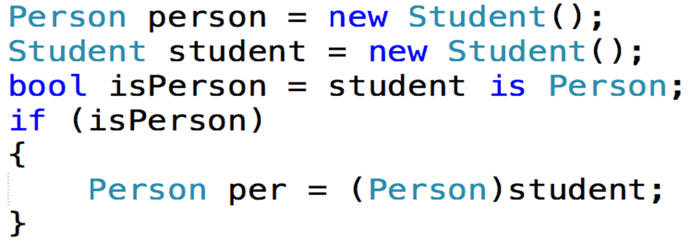
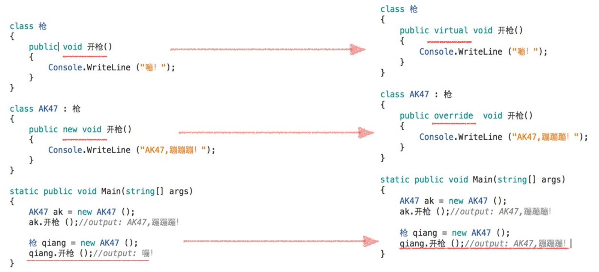

# 第七章 面向对象编程思想
- [第七章 面向对象编程思想](#第七章-面向对象编程思想)
  - [7.1 构造和析构方法](#71-构造和析构方法)
    - [7.1.1 构造方法](#711-构造方法)
    - [7.1.2 析构方法](#712-析构方法)
  - [7.2 面向对象的程序设计](#72-面向对象的程序设计)
    - [7.2.1 特性](#721-特性)
    - [7.2.2 目标](#722-目标)
  - [7.3 面向对象的特征](#73-面向对象的特征)
    - [7.3.1 封装](#731-封装)
    - [7.3.2 继承](#732-继承)
    - [7.3.3 里氏转换](#733-里氏转换)
    - [7.3.4 is和as关键字](#734-is和as关键字)
    - [7.3.5 多态](#735-多态)
    - [7.3.6 密封](#736-密封)
  - [练习1](#练习1)

## 7.1 构造和析构方法
### 7.1.1 构造方法
1. 概念
   实例化一个类，``Woman kity = new Woman ()``。
   Woman类后面的“()”;其实指的就是构造方法。
   只要你想要创建类或结构的实例，必须调用它的构造方法。**构造方法负责对类里面的字段进行初始化。**
2. 特性
   * 构造方法必须与类重名;
   * 构造方法没有返回值，但可以有参数;
   * 构造方法可以有**多个重载**;
   * 不带参数的构造方法称为**默认构造**;
   * 构造方法可以不写，系统会默认的为你的类添加一个**无参构造方法;**  

3. 举例
```cs
class Woman
{
   public int age;  public string name;
   public string country;
   //默认构造
   public Woman(){}
   //自定义构造
   public Woman(int age, string name , string country)
   {
   this.age = age;  
   this.name = name;  
   this.country = country;
   }
}
```
### 7.1.2 析构方法
1. 概念
   析构方法用于析构类的实例。  
   构造方法用户实例化，分配内存空间，而析构方法正好与它  相反，用于释放内存空间。
2. 代码
   ```cs
   class Car
   {
      ~Car()	// destructor
      {
      // cleanup statements...
      }
   }
   ```
3. 特性
   * 不能在结构中定义析构方法，只能对类使用析构方法。
   * 一个类只能有一个析构方法。
   * 无法继承或重载析构方法。
   * 无法调用析构方法，它们是被自动调用的。
   * 析构方法既没有修饰符，也没有参数。

## 7.2 面向对象的程序设计
### 7.2.1 特性
封装、继承、多态
### 7.2.2 目标
重用性、灵活性和扩展性

## 7.3 面向对象的特征
### 7.3.1 封装
封装是实现面向对象程序设计的第—步，封装就是将数据或函数等集合在一个个的单元中（我们称之为类）。
封装的意义在于保护或者防止代码（数据）被我们无意中破坏。
### 7.3.2 继承
继承用于创建**可重用、扩展和修改**在其他类中定义的行为的新  类。 其成员被继承的类称为“**基类**”，继承这些成员的类称为“**派生类**”。 派生类只能有一个直接基类。 

但是，继承是可传递的。如果 ClassB 派生出 ClassC，ClassA 派生出 ClassB，  则 ClassC 会继承 ClassB 和 ClassA 中声明的成员。

1. 用法
   通过在派生的类名后面追加冒号和基类名称，可以指定基类。
   ```cs
   public class Animal
   {
       protected string name;
       public Animal()
       {
           name = "coco";
       }
   }
   public class Dog : Animal()
   {
       public Dog()
       {
           Console.WriteLine(name);
       }
   }
   ```
2. 特性
   1. 派生类获得基类的所有方法、字段、属性和事件。
   2. 继承具有传递性。
   3. 派生类可以赋值给基类，但是基类不能赋值给派生类。

### 7.3.3 里氏转换
* 里氏转换原则一：子类对象可以直接赋值给父类对象

  * 转换后可以调用父类里面的公有成员，**子类里面的公有成员调不到了**。

* 里氏转换原则二：父类可以转换成子类，这样就可以调到子类里面的公有成员了。
```cs
Person person = new Student();
```
person可以调父类里面的name,但不能调子类的score
```cs
Student student = person as Student;
```
在第—行代码的基础上，把父类强转成子类，这样student就可以调到子类的score成员了。
as是转换运算符：转换成功，就转换成as后面的类型，否则返回null

### 7.3.4 is和as关键字
is用来判断一个对象是否是指定的类型,是的话返回true,否则返回false

先判断student是否是Person类型，如果是就强制转换，否则就不转换，如果不判断，转换不成功系统会报错

### 7.3.5 多态
当派生类从基类继承时，它会获得基类的所有方法、字段、属性和事件。 

派生类可以选择：
* 继承最接近的基类方法而不重写它
* 重写基类中的虚拟成员（方法和属性）。
  * 关键字：virtual、override
* 定义隐藏基类实现的成员的新非虚实现
  * 关键字：new

1. 隐藏方法（新非虚实现）和重写对比


### 7.3.6 密封
sealed修饰符，修饰类为密封的，不可被继承不可被重写。  
```cs
public sealed class Time//不能被继承
{
}
```

派生类可以通过sealed来停  止继承，内部的方法可以通  过sealed来阻止被重写。
```cs
public class C:B
{
    public sealed override void Work(){}
}
```

## 练习1
写一个Ticket类，有一个距离属性(本属性只读,在构造方法中赋值)，不能为负数。
有一个价格属性，价格属性只读，并且根据距离distance计算价格Price (1元/公里)：
0-100公里        票价不打折
101-200公里    总额打9.5折
201-300公里    总额打9折
300公里以上    总额打8折
有一个方法，可以显示这张票的信息：90公里90块钱

```cs
enum Discount:int
    { 
        noDiscount,
        nineFive,
        nine,
        eight
    }

class Program
{
   static void Main(string[] args)
   {
      /*
       4.写一个Ticket类,有一个距离属性(本属性只读,在构造方法中赋值),不能为负数,
      有一个价格属性,价格属性只读,并且根据距离distance计算价格Price (1元/公里):
      0-100公里        票价不打折
      101-200公里    总额打9.5折
      201-300公里    总额打9折
      300公里以上    总额打8折
      有一个方法,可以显示这张票的信息.90公里90块钱
       */

      Ticket firstTicket = new Ticket(Convert.ToInt32(Console.ReadLine()));
      firstTicket.PrintInfo();

   }
}
public class Ticket
{
   public int Distance { get; }

   public float Price { get; }

   public Ticket(int distance)
   {
      if (distance >= 0)
      {
          Distance = distance;
          Price = Distance;

          switch (Distance / 100)
          {
              case (int)Discount.noDiscount:
                  Price = Price * 1; 
                  break;
              case (int)Discount.nineFive:
                  Price = Price * 0.95f; 
                  break;
              case (int)Discount.nine:
                  Price = Price * 0.9f; 
                  break;
              case (int)Discount.eight:
                  Price = Price * 0.8f; 
                  break;
          }
      }
      else 
      {
          Console.WriteLine("Distance必须是正整数");
      }
   }
   //显示这张票的信息
   public void PrintInfo()
   {
      Console.WriteLine("这张票{0}公里，{1}块钱", Distance, Price);
   }
}
```