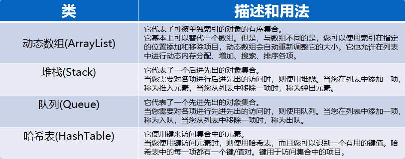
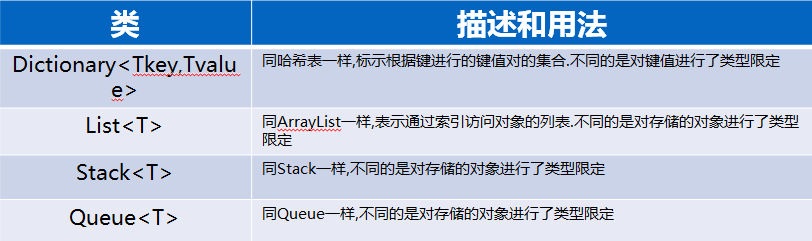
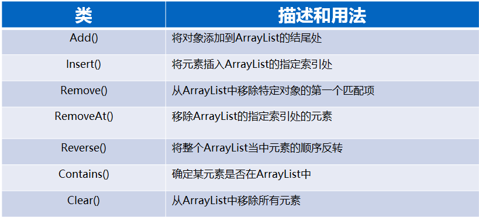
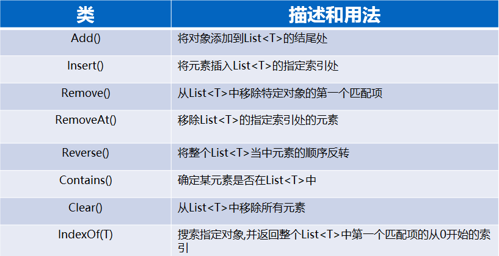
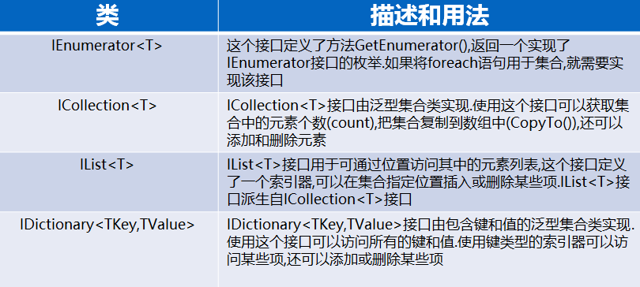
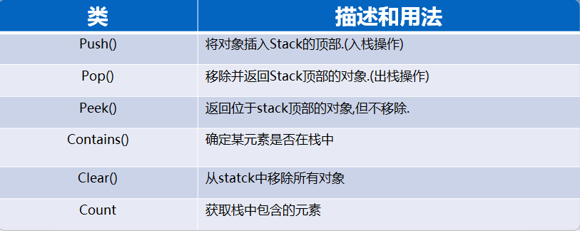
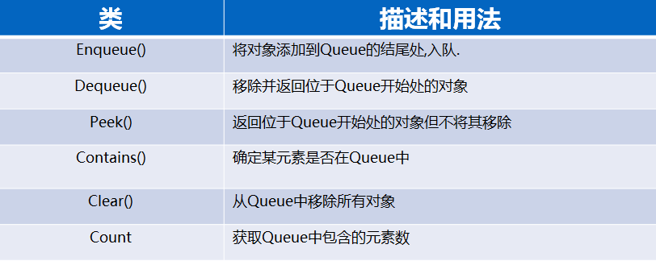

# 第十章 集合
- [第十章 集合](#第十章-集合)
  - [10.1 数组的局限性](#101-数组的局限性)
  - [10.2 集合的概念](#102-集合的概念)
    - [10.2.1 集合的定义](#1021-集合的定义)
    - [10.2.2 集合的类型](#1022-集合的类型)
    - [10.2.3 常见的集合](#1023-常见的集合)
    - [10.2.4 集合的类成员和用法](#1024-集合的类成员和用法)
      - [1. 动态数组-ArrayList](#1-动态数组-arraylist)
      - [2. 泛型动态数组-List\<T\>](#2-泛型动态数组-listt)
      - [3. 堆栈](#3-堆栈)
      - [4. 队列](#4-队列)
  - [练习](#练习)

## 10.1 数组的局限性
* 数组只能存储相同类型的数据
* 数组不能动态地扩展长度

## 10.2 集合的概念
### 10.2.1 集合的定义
集合原本是数学上的一个概念，表示一组具有某种性质的数学元素，引用到程序设计中表示一组具有相同性质的对象。
**集合好比容器**，将一系列相似的组合一起，**是一个特殊的类**，和数组一样，可以通过索引访问集合成员，也可以通过“键”来访问。
与传统数组不同的是，集合的大小可以动态调整，可以在运行时添加或删除元素。

### 10.2.2 集合的类型
* 泛型集合与非泛型集合
* 泛型集合类一般位于**System.Collections.Generic名称空间**。
* 非泛型集合类位于**System.Collections名称空间**。
* 此外，**System.Collections.Specialized名称空间**中也包含一些有用的集合类。

### 10.2.3 常见的集合
* 下面是各种常用的System.Collection 命名空间的类
  

* 下面是各种常用的System.Collection.Generic 命名空间的类
  

### 10.2.4 集合的类成员和用法

#### 1. 动态数组-ArrayList
* 特点：
  * 动态的增加和减少元素
  * 实现了ICollection和IList和IEnumerable接口
  * 灵活的设置数组的大小
  * 不安全的集合类型
  * 其元素为值类型时,效率不高(装箱和拆箱耗性能)  

* ArrayList常用方法与描述

#### 2. 泛型动态数组-List\<T\>
* 特点：
  * **List类是ArrayList类的泛型等效类**
  * 同样继承了**IList接口，IEnumrator接口和ICollection接口**
  * 与ArrayList不同的是，声明集合时需要声明集合内部的数据类型，即T的类型。
  * 安全的集合类型
  * 某种情况时，**在处理值类型时其处理速度比ArrayList快的多**。

* List<T>常用方法与描述：
  

* 常见集合和列表实现接口:
  

#### 3. 堆栈
* 特点：
  * **后进先出**（LIFO）的一种数据结构,本质上堆栈也是一种线性结构
  * 线性结构的基本特点：**即每个节点有且只有一个前驱结点和一个后续节点**
  * 随着像Stack中添加元素，**容量通过重新分配按需自动增加**
  * 可以接受null作为有效值
  * 允许重复的元素
  * 不安全的数据结构
  * 其泛型为Stack<T>  

* Stack常用方法与描述
  

#### 4. 队列
* 特点：
  * **后进先出**(FIFO)的一种数据结构
  * 随着像Queue中添加元素，容量通过重新分配按需自动增加，可以通过**TrimToSize来减少容量**
  * 可以接受null作为有效值
  * 允许重复的元素
  * 不安全的数据结构
  * 其泛型为Queue<T>
  * 在A*算法中会用优先级队列处理路径节点  

* Queue常用方法与描述
  

## 练习
设计一个学生系统,可以存储学生的相关信息(姓名, 学号, 分数等),并设计下列功能.
1.可以根据学生分数排序(降序)
2.可录入新的学生
3.可根据学号删除学生

```cs
class Program
{
    static void Main(string[] args)
    {
        /*
        设计一个学生系统,可以存储学生的相关信息(姓名, 学号, 分数等),并设计下列功能.
          1.可以根据学生分数排序(降序)
          2.可录入新的学生
          3.可根据学号删除学生
        */
        Student[] students = { new Student("小王", 01, 50), 
                                new Student("小兵", 02, 60), 
                                new Student("小红", 03, 55), 
                                new Student("小白", 04, 90)};

        StudentSystem.Instance.Add(students);

        for (int i = 0; i < StudentSystem.Instance.Students.Count; i++)
        {
            Console.WriteLine(StudentSystem.Instance.Students[i].ToString());
        }

        Console.WriteLine();
        StudentSystem.Instance.Remove(03);
        for (int i = 0; i < StudentSystem.Instance.Students.Count; i++)
        {
            Console.WriteLine(StudentSystem.Instance.Students[i].ToString());
        }

        Console.WriteLine();
        StudentSystem.Instance.SortGrade();
        for (int i = 0; i < StudentSystem.Instance.Students.Count; i++)
        {
            Console.WriteLine(StudentSystem.Instance.Students[i].ToString());
        }
    }
}

//学生类
class Student
{
    public string Name { get; set; }
    public int  Id { get; set; }
    public int Grade { get; set; }

    public Student(string name, int id, int grade)
    {
        Name = name;
        Id = id;
        Grade = grade;
    }

    public override string ToString()
    {
        return Name + " " + Id + " " + Grade;
    }
}

//学生信息系统
class StudentSystem
{
    //单例设计模式
    private static StudentSystem instance;
    public static StudentSystem Instance
    {
        get 
        {
            if (instance == null)
            {
                instance = new StudentSystem();
            }
            return instance;
        }
    }
    private StudentSystem() 
    {
        Students = new List<Student>();
    }
    static StudentSystem()
    {
        instance = new StudentSystem();
    }


    //学生表
    public List<Student> Students { get; private set; }

    //录入新的学生
    public void Add(string name, int id, int grade )
    {
        Students.Add(new Student(name, id, grade));
    }
    public void Add(Student[] students)
    {
        Students.AddRange(students);
    }

    //删除学生
    public void Remove(int id)
    {
        for (int i = 0; i < Students.Count; i++)
        {
            if (Students[i].Id == id)
            {
                Students.Remove(Students[i]);
            }
        }
    }

    //可以根据学生分数排序(降序)
    public void SortGrade()
    {
        for (int i = 0; i < Students.Count - 1 ; i++)
        {
            for (int j = 0; j < Students.Count - 1- i; j++)
            {
                if (Students[j].Grade < Students[j + 1].Grade)
                {
                    Student stu = Students[j + 1];
                    Students[j + 1] = Students[j];
                    Students[j] = stu;
                }
            }
        }
    }
}
```