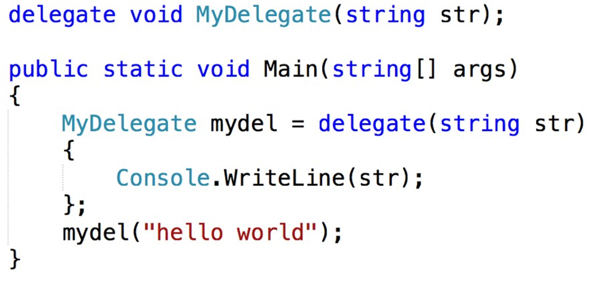
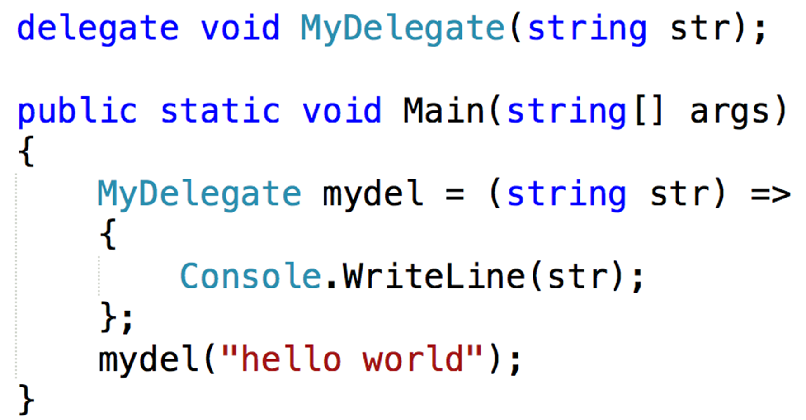
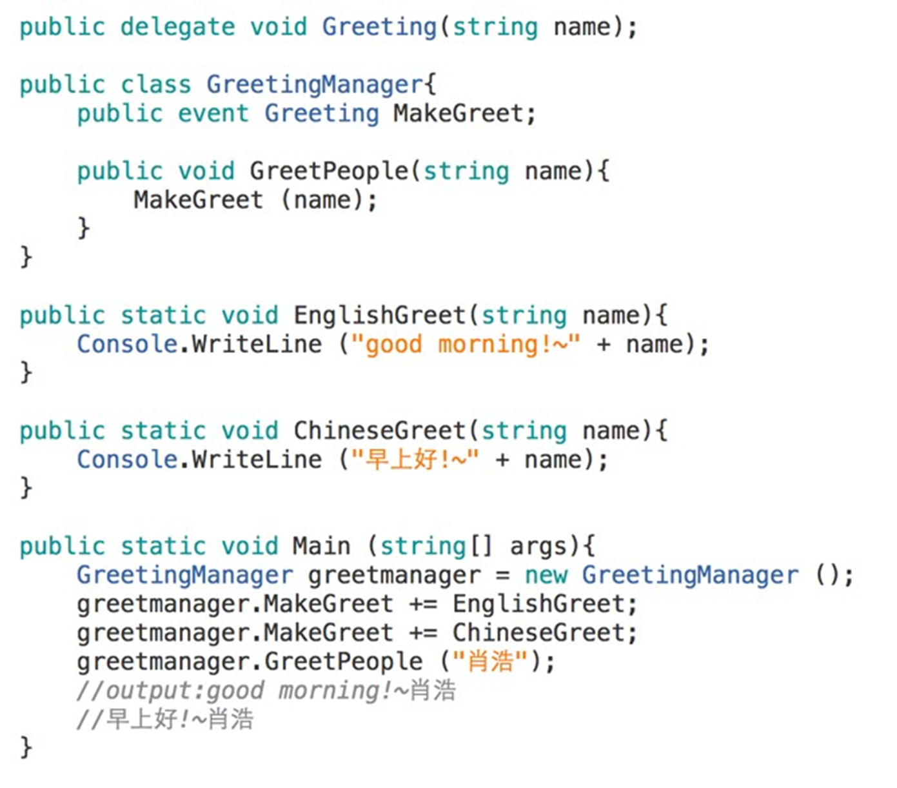

# 第十一章 委托和事件
- [第十一章 委托和事件](#第十一章-委托和事件)
  - [11.1 委托](#111-委托)
    - [11.1.1 委托的概念](#1111-委托的概念)
    - [11.1.2 委托的声明](#1112-委托的声明)
    - [11.1.3 委托的使用](#1113-委托的使用)
    - [11.1.4 委托的合并](#1114-委托的合并)
    - [11.1.5 匿名委托](#1115-匿名委托)
      - [1. delegate定义](#1-delegate定义)
      - [2. lambda表达式](#2-lambda表达式)
      - [3. Func委托](#3-func委托)
      - [4. Action委托](#4-action委托)
  - [11.2 事件](#112-事件)
    - [11.3.1 事件的由来](#1131-事件的由来)
    - [11.3.2 事件的实例](#1132-事件的实例)
    - [11.3.3 事件的本质](#1133-事件的本质)
    - [11.3.4 观察者设计模式](#1134-观察者设计模式)

## 11.1 委托

### 11.1.1 委托的概念
之前学过的任何类型，不管是值类型还是引用类型，其变量都
可以进行赋值，或者作为方法的参数进行传递。
而如何引用方法或者把方法作为参数进行传递呢?
这就需要用到委托-delegate。

### 11.1.2 委托的声明
委托也是—种类型，它与类—样，需要我们自己来定义。
```cs
一种类型的方法
public void Greeting(string name){}

委托的定义如下:
delegate 返回值类型 委托类型名 (参数)

例如:
delegate void GreetDelegate(string name);  
```
定义时委托类型的返回值和参数与要引用的方法的返回值和参数一致，二者在外形上一样，只是委托用delegate修饰。

### 11.1.3 委托的使用
* 委托的使用分以下三步 
  1. 委托声明   ``GreetDelegate greet;``
  2. 委托实例化 ``greet = Greeting;``
  3. 委托调用  ``greet(string name)``

* 委托类似于函数指针，但与函数指针不同的是，委托是面向对
象的、类型安全的和保险的。
* 委托既能引用静态方法，也能 引用实列方法。

### 11.1.4 委托的合并
* 委托对象的一个属性是可以使用 **“+”** 运算符将多个对象分配给一个委托实例。
* 多播委托包含已分配委托的列表。 在调用多播委托时，它会按顺序调用列表中的委托。 
* **注意：只能合并相同类型的委托**。
* 代码
  ```cs
  GreetDelegate greet;
  greet = ChineseGreet;
  greet += EnglishGreet;
  greet("紫龙");
  //早上好！紫龙
  //Good Morning!紫龙
  ```
* 当委托绑定多个有返回值的方法时,其结果是最后绑定的那个方法的返回值，前面绑定方法的返回值会被最后绑定方法的返回值所覆盖，**所以使用委托时一般不带返回值**。


### 11.1.5 匿名委托
委托变量在绑定方法时，是把方法名赋值给了委托变量名,这样就需要在类里面定义方法，而有些方法只用到了一次,这样的方法在类里面过多时，程序的可读性就不是太好，针对这种情况，可以使用**匿名委托，即不用在类里面额外定义方法**。

#### 1. delegate定义
* 格式:
  * delegate(参数){要执行的代码};  
  * 参数：相当于绑定方法的参数{};
    

#### 2. lambda表达式
* 格式:
  * (参数)=>{要执行的代码};  
  * 参数：相当于绑定方法的参数{};
  

#### 3. Func委托
* 格式：
  * ``Func<int,int,int> s =delegate(int,int){  return int;};``
* 使用Func泛型，前面两个是参数类型，最后—个是返回值类型，其变量可以绑定**匿名委托，lambda表达式**和**相同类型的方法**，此种委托一定会有返回值;

#### 4. Action委托
* 格式:
  * ``Action<string> action = delegate(string){};``
* 使用Action泛型，<>里面的类型是参数的类型，**该种委托可以绑定匿名委托，lambda表达式和方法**，但其—定没有返回值.

## 11.2 事件

### 11.3.1 事件的由来
委托也是—种类型，根据面向对象编程的特性，通常会把一个类型的变量封装到类的内部，并把其设置成private的,然后通过属性来访问该变量，所以在实际编程时委托类型也会定义在类里面。

使用event关键字来修饰委托变量，**其本质上是委托变量的属性**。
### 11.3.2 事件的实例


### 11.3.3 事件的本质
* 在类的内部，不管声明它是public还是protected，他总是  private的。即在类的外部，不能够用“=”直接给属性赋值,需用**注册“+=”和注销“-=”的访问限定符**与声明事件时使用的访问限定符相同。

* **发送（或引发）事件的类称为“发行者”**，**接收（或处理）事  件的类称为“订阅者”**。事件的触发必须在发行者内部,在客 户端是不能触发的.

### 11.3.4 观察者设计模式
* 由事件的特性引发出了一种设计模式-**观察者设计模式**，该设计模式是为了定义对象间的一种**一对多的依赖关系**，以便于当一个对象的状态改变时，其他依赖它的对象会被自动告知并更新。  

* 该设计模式包含以下两个类:
  * 被监视对象:
    * 它往往包含其他对象所感兴趣的内容;  
  * 监视者:
    * 用来监视被监视对象,当被监视对象触发事件时,监视者能自动接收事件
* 实例：
  * 以热水器烧水为列,当温度达到95度以上时,液晶显示器来显  示当前的温度,报警器会报警:
  * 被监视对象: 热水器的温度,当烧水的温度达到95度时,会触 发事件, 发送给液晶显示器和报警器;
  * 监视者: 液晶显示器和报警器,自动接收事件;
  ```cs
    class Program
    {
        static void Main(string[] args)
        {

            //以热水器烧水为列,当温度达到95度以上时,液晶显示器来显  示当前的温度,报警器会报警:
            //被监视对象: 热水器的温度,当烧水的温度达到95度时,会触 发事件, 发送给液晶显示器和报警器;
            //监视者: 液晶显示器和报警器,自动接收事件;

            Heater heater = new Heater();
            Alarm alarm = new Alarm(heater);
            Screen screen = new Screen(heater);

            for (int i = 1; i <= 100; i++)
            {
                heater.HeatGo();
            }
        }
    }

    class Heater
    {
        public event Action m_sendAll;

        private int template;

        public void HeatGo()
        {
            template++;
            Console.WriteLine("当前水温是：" + template + "度。");
            if (template >= 95) m_sendAll();
        }
    }

    class Alarm
    {
        public Alarm(Heater heater)
        {
            heater.m_sendAll += StartAlarm;
        }

        public void StartAlarm()
        {
            Console.WriteLine("警报！警报！水温过高！");
        }
    }

    class Screen
    {
        public Screen(Heater heater)
        {
            heater.m_sendAll += StartFlare;
        }

        public void StartFlare()
        {
            Console.WriteLine("红光！红光！水温过高！");
        }
    }
  ```