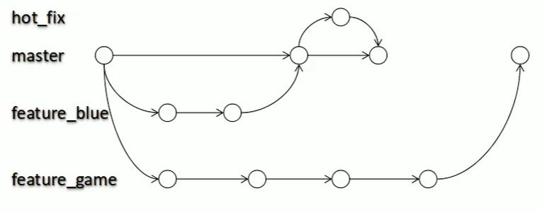
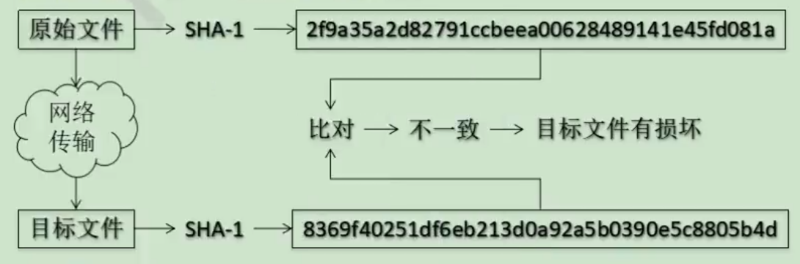
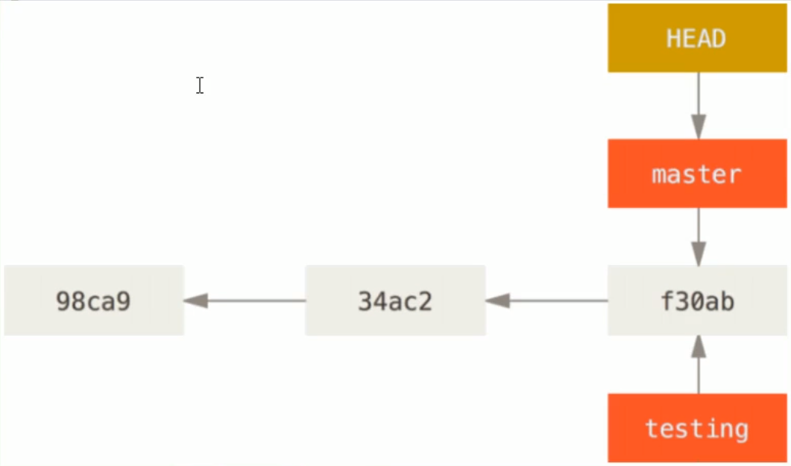
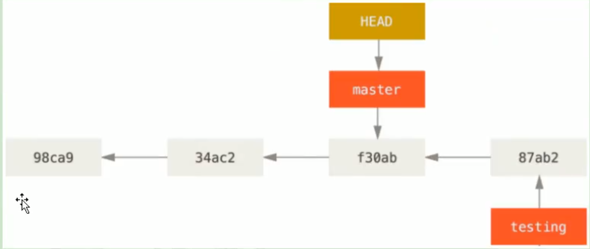

# Git&GitHub学习笔记

---
## 一、版本控制
个人：为了在一次项目中，从任何发阶段修改代码。
团队：为了在一次项目中，多人向服务器提交代码、而不产生覆盖操作。

### 1.1 版本控制工具的功能
* 协同修改：多人并行、互不冲突
* 数据备份：保存每个提交过的历史状态
* 版本管理：SVN采用**增量式**，GIT采用**系统快照**
* 权限控制：团队中人员、团队外贡献者（GIT独有）
* 历史记录：查看日志、恢复历史状态
* 分支管理：多生产线同时推进
---
## 二、GIT
### 2.1 Git本地结构

*简单示意图*
* 工作区-写代码
```
    //使用此命令，将代码添加到暂存区
    git add
```
* 暂存区-临时存储
```
    //使用此命令，将代码提交到本地库
    git commit
```
* 本地库-历史版本

### 2.2 Git和代码托管中心
* 局域网
  * ：GitLab
* 外网：
  * GitHub 
  * 码云

### 2.3 本地库和远程库交互

* 组内交互
  1. 先由原本地库**push**内容到远程库
  1. 另一台本地库**clone**远程库的内容到本地
  2. 该本地库修改后，再**push**修改的内容到远程库
  3. 最后原本地库**pull**远程库更新的内容    
   

*简单示意图*

* 组外交互
  先**fork**出另一个远程库，经过同样的流程后，由组外人员提出**pull request**，经过审核方可将两个远程库**merge**

---
## 三、Git命令行操作
*命令行语句在Git Bash里执行（Git命令与Linux命令兼容）*

### 3.1 本地库初始化

* 命令：
  ```
  $ git init
  ```
* 效果
  ```
  Initialized empty Git repository in XX:/XXX/.git/
  ```
* 注意：.git/目录中存放的是本地库相关文件，不要胡乱修改

### 3.2 设置签名

* 形式
  * 用户名：xxx
  * Email地址：xxx@xxx.com
* 作用：区分不同开发人员身份
* **注意：这里的签名和登录远程库（GitHub等）的账号密码无关**
* 命令
  * 项目/仓库级别：只在本地库范围内有效的签名
    ```
    $ git config user.name xxx              //创建用户名
    $ git config user.email xxx@xxx.com     //创建邮箱
    ```
  * 系统用户级别：当前操作系统用户的签名
    ```
    $ git config --global user.name xxx               //创建用户名
    $ git config --global user.email xxx@xxx.com      //创建邮箱
    ```
  * 查看当前签名
    * 项目级别
    ```
    //先切换到当前项目的根目录下
    $ cat .git/config
    ```
    * 仓库级别
    ```
    $ cat ~/.gitconfig
    ```
  * 优先级
    * 就近原则：项目级别 > 系统级别
    * 不可以二者都没有
    * **一般情况下，使用系统用户的签名即可**

### 3.3 常用操作

#### 3.3.1 查看状态
```
//查看工作区、暂存区状态
$ git status
```

#### 3.3.2 添加到暂存区
```
//添加到暂存区
$ git add [filename]
```

#### 3.3.3 提交到工作区
```
//提交到工作区
$ git commit -m "commit message" [filename]
```
#### 3.3.4 查看历史状态
```
//完整查看
$ git log
//简洁显示
$ git log --pretty=oneline
//单行显示
$ git log --oneline
//字典显示
$ git reflog
```

#### 3.3.5 版本的前进后退
* 基于索引值
  ```
  $ git reset --hard [索引值]
  ```
* "^"(后退一格)
  ```
  //后退一格
  $ git reset --hard HEAD^
  //后退两格
  $ git reset --hard HEAD^^
  ```
* "~"(后退n格)
  ```
  //后退n格
  $ git reset --hard HEAD~n
  ```

#### 3.3.6 reset命令的参数
* --soft
  * 只修改本地库的HEAD指针
* --mixed
  * 修改本地库HEAD指针
  * 重置暂存区
* --hard
  * 修改本地库HEAD指针
  * 重置暂存区
  * 重置工作区

#### 3.3.7 文件的比较
* 与暂存区比较**某一个文件**
  ```
  $ git diff [文件名]
  ```
* 与本地库比较**某一个文件**
  ```
  $ git diff [索引值][文件名]
  ```
* 与暂存区比较**所有文件**
  ```
  $ git diff
  ```
### 3.4 分支管理
#### 3.4.1  什么是分支？
* 在版本控制中，使多条线路并行推进多个任务。
  
  *简单分支流程图*

#### 3.4.2  分支的好处？
* 多条线路并行，开发效率高
* 分支独立，单独一条分支错误，不会影响其他分支的进度

#### 3.4.2  分支的操作
* 创建分支
  ```
  $ git branch [分支名]
  ```
* 查看分支
  ```
  $ git branch -v
  ```
* 切换分支
  ```
  $ git checkout [分支名]
  ```
* 合并分支
  * 先切换到**需要修改的分支**上
  * 执行合并命令
  ```
  $ git merge [分支名]
  ```
* 解决冲突
  1. 修改文件中冲突部分
  2. 执行添加命令
    ```
    $ git add [文件名]
    ```
  3. 提交分支到本地库（**不加文件名**）
    ```
    $ git commit -m "日志信息"
    ```

---
## 四、Git原理
### 4.1 哈希算法
哈希算法有以下几个特点：
* 不管输入数据有多大，同一个哈希算法得到的结果，长度固定
* 哈希算法固定、输入数据固定时，输出值也固定
* 哈希算法固定、输入数据有一点变化，输出值就会发生变化
* 哈希算法不可逆

验证文件的原理


### 4.2 Git分支管理机制
#### 4.1 分支的创建
* 创建一个指针（master）指向版本
* 再创建一个指针（testing）也指向相同版本


#### 4.1 分支的切换
* 切换版本，则master会指向不同版本
* 若要切换到分支testing，则HEAD指针指向testing，即可切换


---
## 五、GitHub
### 5.1 创建远程仓库
* 右上角“+”，选择new repository
* 填写Repository Name(仓库名称)
* 选择Public/Private
### 5.2 一些基本操作
  * 推送
    ```
    //第一次推送前，先执行命令，把远程仓库地址保存到origin
    git remote add origin [远程仓库地址]
    //查看远程库
    git remote -v
    //推送至远程库
    git push [分支]
    ```
  * 克隆
    ```
    git clone [远程库地址]
    ```
  * 远程库邀请人员加入
    * 项目界面-Settings-Collaborators-Add collaborator
  * 拉取
    * **pull = fecth + merge**
    * **fecth**-抓取-只把远程库下载至本地
      ```
      git fetch [远程库] [远程分支]
      ```
    * **merge**-合并-把下载的库合并到本地
      ```
      git merge [远程库/远程分支]
      ```
    * **pull**-拉取-下载并合并