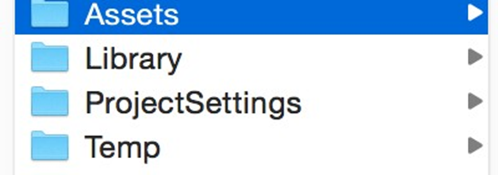

# 第一章 脚本开发基础
- [第一章 脚本开发基础](#第一章-脚本开发基础)
  - [1.1 Unity组件开发](#11-unity组件开发)
    - [1.1.1 工程与应用](#111-工程与应用)
    - [1.1.2 Unity开发系统](#112-unity开发系统)
  - [1.2 Unity脚本组件](#12-unity脚本组件)
    - [1.2.1 脚本类](#121-脚本类)
    - [1.2.2 脚本生命周期](#122-脚本生命周期)
  - [1.3 常用类](#13-常用类)
    - [1.3.1 Component类-组件](#131-component类-组件)
    - [1.3.2 Transform类](#132-transform类)
    - [1.3.3 Vector3类](#133-vector3类)
    - [1.3.4 Time类](#134-time类)
    - [1.3.5 Mathf类](#135-mathf类)
  - [1.4 预制体](#14-预制体)
    - [1.4.1 游戏对象和预制体](#141-游戏对象和预制体)
    - [预制体的实例化](#预制体的实例化)

## 1.1 Unity组件开发

### 1.1.1 工程与应用

* Assets： 
  * 里面存放的是项目所需要的资源； 
* Library： 
  * 里面存放的是所需要的库文件； 
* ProjectSettings： 
  * 里面存放的是工程设置文件； 
* Temp： 
  * 里面存放的是临时文件；
### 1.1.2 Unity开发系统
* 一个工程里面有多个场景，相当于一个游戏有多个关卡；
* 一个场景里面有多个游戏对象，相当于游戏中的不同的元素；
* 每个游戏对象又有一个或者多个组件，游戏对象想要实现什么样的功能只需要加上相对应的组件即可；


## 1.2 Unity脚本组件

### 1.2.1 脚本类
Unity中的常用脚本类就可以简单的分成如下四大类：

* 宏观控制类：
  * 主要作用是针对Unity程序中的某一方面进⾏行宏观控制。包括 应用**程序类(Application)**、**输⼊入类(Input)**、**图形输出类(GUI)**、**物理引擎类(Physics)**、**资源类(Resources)**、**时间类(Time)**等。
* 游戏对象(GameObject)类：
  * 表示当前脚本挂在的游戏对象组件
* 组件(Component)类：
  * 脚本开发中的组件类往往可以和图形界面中的检视面板对应起来。每一个游戏对象的细节设置与操控都需要借助组件类来完成。
* 资源类：
  * 对于刚⼊入⻔门的初学者来说，资源一般都是在图形界面导⼊入进来之后直接使用。**精通资源类是走出初学阶段很重要的一步，也是代码开发摆脱素材限制的一种重要手段**。
* MonoBehaviour类：
  * Unity脚本组件必须继承MonoBehaviour类。
  * 继承自MonoBehaviour的脚本组件可以自动调用其封装好了的回调方法。

### 1.2.2 脚本生命周期

* 初始阶段
  * **Awake()唤醒：**
    * 当物体载入时立即调用1次，常用于在游戏开始前进行初始化，可以判断当满足某种条件执行此脚本this.enable=true。
  * **OnEnable()当可用：**
    * 每当脚本对象启用时调用。
  * **Start()开始：**
    * 物体载入且脚本对象启用时被调用1次。常用于数据 或游戏逻辑初始化，执行时机晚于Awake。
  
* 物理阶段

  * **FixedUpdate()固定更新：**
    * 脚本启用后，固定时间被调用，适用于对游戏对象做物理操作，例如移动等。
    * 设置更新频率：“Edit”—>“Project Setting”—>“Time”—>“Fixed Timestep”值，默认为0.02s。
  
* 游戏逻辑

  * **Update()更新：**
    * 脚本启用后，每次渲染场景时调用，频率与设备性能及渲染量有关。
  * **LateUpdate()延迟更新：**
    * 在Update函数被调用后执行，适用于跟随逻辑。
  
* 场景渲染

  * **OnGUI()渲染：**
    * 渲染和处理GUI事件时调用
  * **OnBecameVisible()当可见：**
    * 当Mesh Renderer在任何相机上可见时调用。
  * **cameInvisible当不可见：**
    * 当Mesh Renderer在任何相机上不可见时调用。

* 结束阶段

  * **OnDisable()当不可用：**
    * 对象变为不可用和附属游戏对象非激活状 态时此函数被调用。
  * **OnDestroy()当销毁：**
    * 当脚本销毁或附属的游戏对象被销毁时调用。
  * **OnApplicationQuit()当程序结束：**
    * 应用程序退出时被调用。

## 1.3 常用类

* API(Application Programming Interface)应用程序编程接口，是一些预先定义的函数。
* Untiy引擎提供了丰富的组件和类库，为开发者提供了非常大的便利，熟练掌握和使用这些API对于游戏开发效率提高很重要。

### 1.3.1 Component类-组件


### 1.3.2 Transform类
* Transform组件作用：
  1. 负责游戏对象的变换（位置，旋转和缩放）
  2. 维持父子关系


### 1.3.3 Vector3类
* 点乘
  * 又称“点积”或“内积”。
  * 公式：
    * 各分量乘积和 
    * $[x1,y1,z1]*[x2,y2,z2] = x1x2+y1y2+z1z2$
  * 几何意义：
    * $a·b = |a|·|b|cos<a,b>$
    *  两个向量的单位向量相乘后 再乘以二者夹角的余弦值。
  * API:
    * ``float dot = Vector3.Dot(Va,Vb);``
* 点乘应用
    对于标准化过的向量，点乘结果等于两向量夹角的余弦值。 
    应用 ：计算两向量夹角
  ```cs
  float dot = Vector3.Dot( a.normalized , b.normalized);
  float angle = Mathf.Acos(dot) * Mathf.Rad2Deg;
  ```
* 叉乘
又称“叉积”或“外积”。

  * 公式：
    * 各分量乘积和 
    * $[x1,y1,z1]*[x2,y2,z2] =[y1*z2- z1*y2,z1*x2-x1*z2,x1*y2-y1*x2]$

  * 几何意义:结果为两个向量所组成面的垂直向量，模长为两向量模长乘积再乘夹角的正弦值。

  * 脚本： ```Vector vector = Vector3.Cross(a,b);```
* 叉乘应用
    创建垂直于平面的向量。 判断两条向量相对位置。

* Vector3类的方法和属性


### 1.3.4 Time类

### 1.3.5 Mathf类


## 1.4 预制体
### 1.4.1 游戏对象和预制体
预设体是一个游戏对象及其组件的集合，目的是使游戏对象及资源能够被重复使用，相同的游戏对象可以通过一个预设体来创建，此过程可以理解为实例化。

**把一个游戏对象从层级视窗拖到工程视窗后就会生成一个预设体。**


### 预制体的实例化
```cs
static Object Instantiate(Object original, Vector3 position, Quaternion rotation);

```