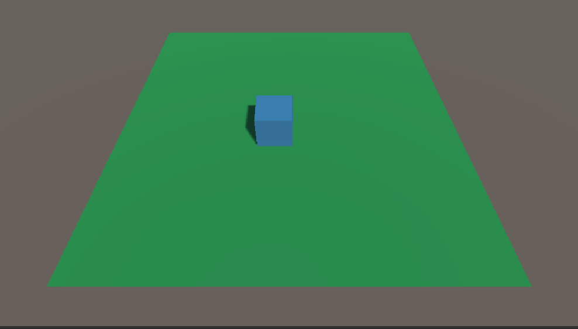

# 第二章 物理引擎
- [第二章 物理引擎](#第二章-物理引擎)
  - [2.1 人机交互](#21-人机交互)
    - [2.1.1 键盘输入](#211-键盘输入)
    - [2.1.2 鼠标输入](#212-鼠标输入)
  - [2.2 碰撞器](#22-碰撞器)
    - [2.2.1 Collider碰撞器组件](#221-collider碰撞器组件)
    - [2.2.2 场景物体的鼠标事件](#222-场景物体的鼠标事件)
  - [2.3 刚体组件](#23-刚体组件)
    - [2.3.1 刚体的作用](#231-刚体的作用)
    - [2.3.2 刚体组件的使用](#232-刚体组件的使用)
    - [2.3.3 注意事项](#233-注意事项)
    - [2.3.4 刚体组件常用属性和方法](#234-刚体组件常用属性和方法)
  - [2.4 碰撞检测](#24-碰撞检测)
    - [2.4.1 碰撞器的回调方法](#241-碰撞器的回调方法)
  - [2.5 触发事件](#25-触发事件)
    - [2.5.1 触发器的回调方法](#251-触发器的回调方法)
  - [2.6 射线](#26-射线)
    - [2.6.1 创建](#261-创建)
  - [练习](#练习)

## 2.1 人机交互
Input类是输入系统的接口，使用这个类能够读取输入管理器设置的按键，以及访问移动设备的多点触控或加速感应数据，可以通过该类来实现外部设备控制游戏场景里面的物体。
### 2.1.1 键盘输入


* 获取水平方向移动
  ```cs
  float hor = Input.GetAxis ("Horizontal");
  ```
### 2.1.2 鼠标输入


## 2.2 碰撞器
### 2.2.1 Collider碰撞器组件
当我们在场景中创建基本游戏物体后，引擎会自动的为该物体  加上Collider(碰撞器)组件，其主要功能是进行碰撞检测。


### 2.2.2 场景物体的鼠标事件


## 2.3 刚体组件

### 2.3.1 刚体的作用
刚体能够受到力作用，逼真的展示物体运动效果
1. 重力：自由落体
2. 反作用力：例如，与其它物体碰撞
3. 阻力：受到阻力会慢慢停止运动
4. 外加力：可以给物体施加—个外力

### 2.3.2 刚体组件的使用


### 2.3.3 注意事项
* 对同一个物体，要么通过刚体操纵，要么通过变换操纵，**不要同时使用刚体和变换来操纵**。因为给刚体施加力和力矩，也会改变物体变换组件的位置和旋转角度，同时使用两种方式会导致旋转和其它计算出现问题。
* 如果需要直接操纵物体变换，同时又想拥有刚体特性，**那么需要你选择运动学**。

### 2.3.4 刚体组件常用属性和方法


## 2.4 碰撞检测
### 2.4.1 碰撞器的回调方法

* 注意事项：
  * 碰撞发生的条件:  
    1. 发生碰撞的两个物体都必须带有Collider
    2. 发生碰撞的两个物体至少有一个带有刚体
    3. 发生碰撞的两个物体必须有相对运动

## 2.5 触发事件
* 触发器事件执行的条件：
  * 两个物体上都要带碰撞器，至少带有一个刚体，并且两物体至少有一个把触发器打开。

### 2.5.1 触发器的回调方法


## 2.6 射线
Unity提供了射线机制：通过**虚拟射线检测**所碰撞到的物体。

### 2.6.1 创建
```cs
//从主摄像机到鼠标点击位置创建—条射线;
Ray ray = Camera.main.ScreenPointToRay(Input.mousePosition);
//使用Physics类方法Raycast方法实现射线碰撞检测功能;
bool Raycast(Ray ray, out RaycastHit hitInfo);
```

## 练习
使用射线，实现物体移动到鼠标的指定位置。

```cs
using System.Collections;
using System.Collections.Generic;
using UnityEngine;

public class Cube : MonoBehaviour
{
    Vector3 movePosition;           //起始位置
    public int speed;               //移动速度

    // Update is called once per frame
    void Update()
    {
        //当鼠标按下
        if (Input.GetMouseButtonDown(1) || Input.GetMouseButton(1))
        {
            //获取鼠标点击位置
            Ray myRay = Camera.main.ScreenPointToRay(Input.mousePosition);
            RaycastHit hit;
            if (Physics.Raycast(myRay, out hit))
            {
                Debug.Log("碰到了：" + hit.point);
            }
            //计算须移动的位置
            if (hit.collider.name == "Plane")
            {
                movePosition = hit.point + new Vector3(0, 0.5f, 0);
            }
        }
        
    }

    private void FixedUpdate()
    {   
        if (movePosition != transform.position && movePosition != new Vector3(0,0,0))
        {
            //计算移动距离和方向
            Vector3 offset = movePosition- transform.position;
            if (Mathf.Abs(offset.x) > 0.1 || Mathf.Abs(offset.z) > 0.1)
            {
                //按帧移动
                transform.Translate(offset.normalized * speed * Time.deltaTime);
            }
        }
    }
}
```